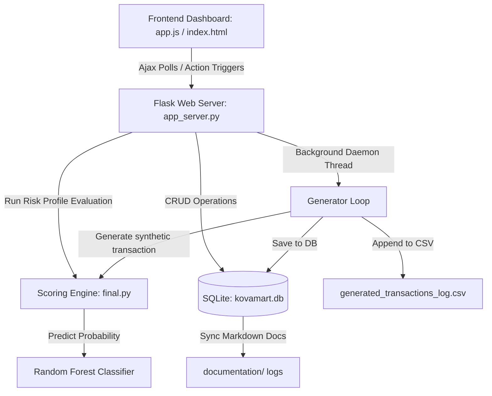

# Kova Mart - Fraud Detection & Audit System Documentation

This document provides a comprehensive technical overview of the **Kova Mart** fraud prevention ecosystem, including its architecture, database schemas, scoring engines, background daemon processing, REST APIs, and client-side flows.

---

## 1. System Architecture & Data Flow

Kova Mart utilizes a real-time hybrid architecture combining a Flask-based Python web server, an SQLite relational database, and an offline-trained Machine Learning scoring engine.



### Core Flow of Operations
1. **Transaction Event**: Transactions are registered via synthetic generation, simulator sandboxes, or pre-transaction checkout endpoints (`/api/checkout`).
2. **Analysis & Hybrid Scoring**: The transaction is scored in `final.py`. If a transaction score is $\ge 40\%$, a security alert is triggered.
3. **Automated Interception / Manual reviews**:
   - **Low Risk (< 40%)**: Automatically approved and saved.
   - **High/Critical Risk ($\ge 55\%$)**: Automatically blocked.
   - **Medium Risk (40% - 54%)**: Intercepted in the Simulator UI to show an inline modal reviewer.
4. **Data Syncing**: Database writes trigger background markdown file syncs to maintain persistent offline logs in the `documentation/` directory.

---

## 2. Database Schema (`kovamart.db`)

The database is built on SQLite. It is structured into seven primary tables, with optimized composite indexes to handle concurrent queries under high load.

### Schema Details

#### 1. `members`
Tracks registered beneficiaries, their masked sensitive credentials, registration details, and verification status.
*   `id`: `INTEGER PRIMARY KEY AUTOINCREMENT`
*   `name`: `TEXT NOT NULL`
*   `nik`: `TEXT UNIQUE NOT NULL` (National ID card number)
*   `phone`: `TEXT UNIQUE NOT NULL`
*   `kks_card`: `TEXT UNIQUE NOT NULL` (Subsidized family card)
*   `address`: `TEXT NOT NULL`
*   `registration_date`: `TEXT NOT NULL`
*   `verification_status`: `TEXT NOT NULL` (`Verified`, `Unverified`, `Flagged`, `Blocked`)
*   `device_info`: `TEXT NOT NULL` (User browser signature user-agent)
*   `ip_address`: `TEXT NOT NULL`
*   `created_at`: `TEXT DEFAULT CURRENT_TIMESTAMP`

#### 2. `transactions`
Records customer transaction attempts, balance updates, and operational status.
*   `id`: `INTEGER PRIMARY KEY AUTOINCREMENT`
*   `customer_id`: `INTEGER NOT NULL` (FK -> `members.id`)
*   `initial_subsidy`: `REAL NOT NULL`
*   `transaction_amount`: `REAL NOT NULL`
*   `subsidy_balance`: `REAL NOT NULL`
*   `hour_of_day`: `INTEGER NOT NULL`
*   `num_items`: `INTEGER NOT NULL`
*   `repeated_product_purchase`: `INTEGER NOT NULL` (0 or 1)
*   `same_product_transaction_count_month`: `INTEGER NOT NULL`
*   `prev_transactions`: `INTEGER NOT NULL`
*   `is_first_transaction`: `INTEGER NOT NULL` (0 or 1)
*   `national_id_verification`: `INTEGER NOT NULL` (0 or 1)
*   `kks_card_validation`: `INTEGER NOT NULL` (0 or 1)
*   `duplicate_account_detection`: `INTEGER NOT NULL` (0 or 1)
*   `transaction_frequency_high`: `INTEGER NOT NULL` (0 or 1)
*   `valid_card`: `INTEGER NOT NULL` (0 or 1)
*   `ip_outside_indonesia`: `INTEGER NOT NULL` (0 or 1)
*   `app_vs_kiosk`: `INTEGER NOT NULL` (0 = app, 1 = kiosk)
*   `failed_login_attempts`: `INTEGER NOT NULL`
*   `payment_retry_count`: `INTEGER NOT NULL`
*   `same_device_multiple_accounts`: `INTEGER NOT NULL` (0 or 1)
*   `login_location_changed`: `INTEGER NOT NULL` (0 or 1)
*   `status`: `TEXT DEFAULT 'pending'` (`approved`, `blocked`, `review`, `pending`)
*   `notes`: `TEXT`
*   `created_at`: `TEXT DEFAULT CURRENT_TIMESTAMP`

#### 3. `alerts`
Tracks unresolved and resolved security flags generated by the scoring engine.
*   `id`: `INTEGER PRIMARY KEY AUTOINCREMENT`
*   `alert_id`: `TEXT UNIQUE NOT NULL` (Format: `ALT-YYYYMMDD-TX[id]`)
*   `target_type`: `TEXT NOT NULL` (`transaction` or `member`)
*   `target_id`: `INTEGER NOT NULL`
*   `customer_name`: `TEXT NOT NULL`
*   `customer_id`: `INTEGER NOT NULL`
*   `risk_score`: `REAL NOT NULL`
*   `fraud_indicators_triggered`: `TEXT NOT NULL` (JSON array of strings)
*   `transaction_details`: `TEXT` (JSON dictionary of input parameters)
*   `detection_timestamp`: `TEXT NOT NULL`
*   `status`: `TEXT NOT NULL` (`Open`, `Under Review`, `Resolved`)
*   `severity_level`: `TEXT NOT NULL` (`Low`, `Medium`, `High`, `Critical`)
*   `recommended_action`: `TEXT NOT NULL`
*   `created_at`: `TEXT DEFAULT CURRENT_TIMESTAMP`

#### 4. `risk_scores`
Detailed risk percentage outputs generated for each transaction/member check.
*   `id`: `INTEGER PRIMARY KEY AUTOINCREMENT`
*   `target_type`: `TEXT NOT NULL` (`transaction` or `member`)
*   `target_id`: `INTEGER NOT NULL`
*   `rule_based_pct`: `REAL NOT NULL` (From heuristic combination matrices)
*   `ai_prob`: `REAL NOT NULL` (From RF model confidence)
*   `final_pct`: `REAL NOT NULL` (Overall aggregated risk score)
*   `level`: `TEXT NOT NULL` (`LOW`, `MEDIUM`, `HIGH`, `CRITICAL`)
*   `verdict`: `TEXT NOT NULL`
*   `triggered_flags`: `TEXT NOT NULL` (JSON list of binary indicators)
*   `triggered_combos`: `TEXT NOT NULL` (JSON list of matched C1-C13 rules)
*   `created_at`: `TEXT DEFAULT CURRENT_TIMESTAMP`

#### 5. `audit_logs`
Chronological operations log mapping system behaviors and auditor overrides.
*   `id`: `INTEGER PRIMARY KEY AUTOINCREMENT`
*   `target_type`: `TEXT NOT NULL` (`member`, `transaction`, or `alert`)
*   `target_id`: `INTEGER NOT NULL`
*   `action`: `TEXT NOT NULL`
*   `note`: `TEXT`
*   `operator`: `TEXT DEFAULT 'System'` (e.g. `'System'` or `'Auditor'`)
*   `timestamp`: `TEXT NOT NULL`
*   `created_at`: `TEXT DEFAULT CURRENT_TIMESTAMP`

#### 6. `fraud_feedback`
Stores verified outcomes logged by human operations to enable future retraining pipelines.
*   `id`: `INTEGER PRIMARY KEY AUTOINCREMENT`
*   `transaction_id`: `TEXT NOT NULL UNIQUE`
*   `model_decision`: `TEXT NOT NULL`
*   `auditor_decision`: `TEXT NOT NULL`
*   `confirmed_label`: `TEXT NOT NULL CHECK(confirmed_label IN ('fraud', 'legitimate', 'unknown'))`
*   `notes`: `TEXT`
*   `reviewed_by`: `TEXT NOT NULL`
*   `reviewed_at`: `TEXT NOT NULL`
*   `created_at`: `TEXT DEFAULT CURRENT_TIMESTAMP`

#### 7. `fraud_scoring_logs`
Encapsulates logs generated by external pre-transaction API validation checks (`/api/fraud/score`).
*   Matches fields from `transactions` + `request_id`, `transaction_id` string, `ai_probability_score`, `final_risk_score`, and `decision`.

### Optimized Indexes
*   `idx_fraud_scoring_logs_tx_id` on `fraud_scoring_logs(transaction_id)`
*   `idx_fraud_scoring_logs_req_id` on `fraud_scoring_logs(request_id)`
*   `idx_transactions_status` on `transactions(status)`
*   `idx_alerts_alert_id` on `alerts(alert_id)`
*   `idx_audit_logs_target` on `audit_logs(target_type, target_id)` (Accelerates splitscreen history timeline queries)

---

## 3. Training Set & AI Model (`final.py`)

### Training Dataset
The model is trained on `Kova_Mart_Dataset - Sheet1.csv` containing 1,000 transaction samples with 19 feature columns:

| Numerical Features | Binary Features (0/1) |
| :--- | :--- |
| `Initial_Subsidy` | `is_first_transaction` |
| `transaction_amount` | `National_ID_verification` (0 if unverified) |
| `hour_of_day` | `KKS_card_validation` (0 if invalid) |
| `num_items` | `Duplicate_account_detection` |
| `prev_transactions` | `Transaction frequency (>3 per hour)` |
| `failed_login_attempts` | `valid_card` (0 if invalid) |
| `payment_retry_count` | `IP address (outside Indonesia )` |
| `same_product_transcation_count_month` | `app(0) vs kiosk(1)transaction` |
| | `repeated_product_purchase(>10)` |
| | `same_device_multiple_accounts` |
| | `login_location_changed` |

### SMOTE Balancing & Model Architecture
1.  **Imbalance Handling**: The training label `fraud` is computed by check bounds (`risk_pct >= 40` or `IP_Outside == 1`). SMOTE (Synthetic Minority Over-sampling Technique) balances training sets prior to model fitting.
2.  **Machine Learning Classifier**: A **Random Forest Classifier** (`RandomForestClassifier(n_estimators=200, class_weight='balanced')`) is fitted to standard scaled features.
3.  **Model Serialization**: Saved models are dumped into five joblib binaries to bypass retraining on app start:
    - `kova_ai_model.joblib`
    - `kova_ai_scaler.joblib`
    - `kova_ai_features.joblib`
    - `kova_ai_colstats.joblib`
    - `kova_ai_corrmatrix.joblib`

---

## 4. Hybrid Scoring & Heuristic Combination Rules

The scoring system aggregates heuristic rules and Machine Learning outputs to determine final risk:

$$\text{Final Risk Score (\%)} = \max(\text{Heuristic Rule Score}, \text{AI Model Probability}) + \text{Noise}$$

### Heuristic Combination Matrix (Priority Rules C1 to C13)

| Rule ID | Combination Details / Trigger Flags | Risk Floor | Tier | Threat Context |
| :--- | :--- | :---: | :--- | :--- |
| **C1** | Foreign IP + Failed Logins + Payment Retry | 100% | CRITICAL | Brute-force credential stuffing and payment spam |
| **C2** | Foreign IP + Location Changed + Same Device | 95% | CRITICAL | Account hijacking operated via multi-login farms |
| **C3** | Foreign IP + Duplicate Account | 90% | CRITICAL | Ghost account registration created from overseas |
| **C4** | Foreign IP + Subsidy Exhausted | 85% | CRITICAL | Rapid depletion of welfare balances from abroad |
| **C5** | Duplicate Account + Same Device + Location Changed | 80% | CRITICAL | Sybil accounts moving locations on a single device |
| **C6** | High Frequency + Repeated Purchase + Same Product | 75% | HIGH | Scalping of subsidised goods for commercial resale |
| **C7** | Failed Logins + Payment Retry + High Frequency | 70% | HIGH | Automated script/bot brute force payment testing |
| **C8** | Failed Logins + Payment Retry + Invalid Card | 65% | HIGH | Carding tests with guessed logins/card parameters |
| **C9** | Duplicate Account + Payment Retry + Invalid Card | 65% | HIGH | Suspicious account attempting card testing logs |
| **C10** | Duplicate Account + Failed Logins | 60% | HIGH | Account duplicate flagged with failed access logs |
| **C11** | Subsidy Exhausted + High Frequency | 55% | HIGH | Intentional rapid depletion of remaining balances |
| **C12** | Unverified ID + Invalid KKS + Invalid Card | 50% | MEDIUM | Complete credentials invalidation (Ghost Profile) |
| **C13** | Unverified ID + Duplicate Account | 45% | MEDIUM | Identity verify failure combined with duplicate flags |

### Escalation Rules
- **Multi-Combo Escalation**: If multiple combination rules trigger on a single transaction, the highest score acts as the baseline, with an extra $+5\%$ added for each additional active rule.
- **Stand-alone Flags**: Individual indicator flags (e.g. invalid card alone) score $0\%$ risk. Under risk logic, threat classification is triggered only by combined flags.
- **Catch-All Escalation**: If no primary rules (C1-C13) trigger but $\ge 3$ flags are present, the transaction is escalated automatically.

---

## 5. Background Transaction Generator Daemon

The real-time feed in the dashboard is populated by a background daemon loop running inside the web server.

### Mechanism & Concurrency Guards
1.  **Daemon Loop**: Spawned as a background thread (`generator_loop()`) inside the Flask web worker.
2.  **Thread Safety Lock (`engine.lock`)**: Transactions generation, database insertion, and cache invalidation are wrapped inside `with engine.lock` blocks to prevent concurrent write collisions.
3.  **Process Lock File Protection (`generator.lock`)**:
    - During initialization, the daemon writes its current Process ID (PID) to `generator.lock`.
    - On every iteration, the thread verifies that its PID matches the lock file PID.
    - If a mismatch occurs (e.g., when a new Gunicorn worker forks or Render restarts the container), the older thread terminates itself.
4.  **Database Persistence & Documentation Sync**:
    - Generates synthetic parameters based on statistical distributions in `final.py`.
    - Scores transaction, inserts into database tables `transactions` and `risk_scores` (plus `alerts` and `audit_logs` if score is $\ge 40\%$).
    - Appends metadata records to `generated_transactions_log.csv`.
    - Invokes `database.sync_all_documentation()` to export records to Markdown logs.

---

## 6. REST API Reference

All requests must respect rate-limit allocations and header authentication constraints where defined.

### System & Status Endpoints

#### GET `/api/status`
Returns status variables of the background transaction generator daemon.
*   **Response (`200 OK`)**:
    ```json
    {
      "enabled": true,
      "interval_seconds": 30.0,
      "generated_count": 42,
      "last_generated_customer_id": 743,
      "last_generated_at": "2026-06-25T00:32:12"
    }
    ```

#### GET `/api/dashboard`
Returns the cached operations metrics summary, historical line chart datasets, rule effectiveness matrix, and recent transactions.
*   **Parameters**: `reload=true` (forces cache rebuild).
*   **Response (`200 OK`)**:
    ```json
    {
      "status": "success",
      "summary": { "metrics": { "total_transactions": 1500, "flagged_rate": 24.3, "unresolved_alerts": 12 } },
      "rows": [ ... ],
      "chart_data": { ... }
    }
    ```

### Operations & Audit Endpoints

#### GET `/api/transactions`
Retrieves paginated, sorted, and filtered lists of transactions from the database.
*   **Parameters**: `page` (default 1), `limit` (default 12), `search` (customer ID search), `risk_level` (`LOW`/`MEDIUM`/`HIGH`/`CRITICAL`), `status` (`approved`/`blocked`/`review`).
*   **Response (`200 OK`)**:
    ```json
    {
      "status": "success",
      "transactions": [ ... ],
      "total_pages": 125,
      "current_page": 1
    }
    ```

#### POST `/api/transactions/audit`
Records an auditor's overriding decision on reviewable transactions.
*   **Headers**: Requires API Key authentication.
*   **Request Body**:
    ```json
    {
      "transaction_id": 1007,
      "action": "approved",
      "notes": "Verified NIK document matches local database registry."
    }
    ```
*   **Cascade Effect**: Automatically transitions the alert associated with the transaction to `'Resolved'`.

#### POST `/api/members`
Registers a new beneficiary. Runs checks against duplication rules (NIK, Phone, KKS).
*   **Cascade Effect**:
    - **Hard Violations (Duplicated NIK/Phone/KKS)**: Skips SQL insertion. Flags the *existing* member's status to `Flagged`, generates a `Critical` security alert, and returns a `400 Bad Request`.
    - **Soft Violations (Same Device/IP)**: Inserts the new member with status `Flagged`, generates a security alert, and returns `200 OK`.

#### POST `/api/members/<id>/reveal`
Reveals unmasked sensitive fields (NIK, Phone, KKS card) inside the Operations Console for auditor inspection.
*   **Cascade Effect**: Logs an audit entry to `audit_logs` (e.g. *"Auditor unmasked sensitive details for Member #105"*).

### Simulator Endpoints

#### POST `/api/analyze`
Generates scoring predictions and flags for a payload of parameters without writing to the database.
*   **Request Body**: Dictionary of 19 transaction features.
*   **Response (`200 OK`)**:
    ```json
    {
      "status": "success",
      "result": { "final_pct": 52.8, "rule_based_pct": 50.0, "verdict": "⚠️ POSSIBLE FRAUD", "flags": { ... }, "triggered_combos": [ ... ] }
    }
    ```

#### POST `/api/simulator/add`
Saves simulated transaction configurations directly to the database.
*   **Parameters**: Supports optional `status` (`'approved'`/`'blocked'`), `audit_note`, and `operator` payloads to register manual overrides.

### Pre-Transaction Checkout APIs

#### POST `/api/fraud/score`
Performs rate-limited and token-secured pre-transaction risk scoring. Logs request payloads to `fraud_scoring_logs`.
*   **Headers**: Requires `Authorization: Bearer <secret_key>`.

#### POST `/api/checkout`
Coordinates payment clearance before deducting balances.
*   **Heuristic Security Check**: Runs pre-transaction scoring. If score is `BLOCK` or `REVIEW` (score $\ge 40\%$), checkout is halted.
*   **Fail-Closed Policy**: If the scoring engine times out or triggers an internal error, the endpoint defaults to `blocked` to secure welfare balances.

#### POST `/api/fraud/feedback`
Captures verified auditor labels and writes them to SQLite and `retraining_feedback_dataset.csv`.

---

## 7. Security & Guardrail Configurations

1.  **Rate Limiter**: A sliding-window token implementation restricts client IPs to a maximum of **60 requests/minute** on scoring endpoints, returning `HTTP 429` on violations.
2.  **Request Size Limit**: Middleware checks content sizes before parsing JSON request bodies. Payloads larger than **1MB** are rejected with `HTTP 413` errors.
3.  **Authentication Decorator**: Decorators validate token matching (`kova_secret_api_key_2026`) in request headers.
4.  **Fail-Closed Checkout Pattern**: Balance deductions require explicit scoring validation checks. In the event of system engine exceptions, checkouts fail-closed automatically.
